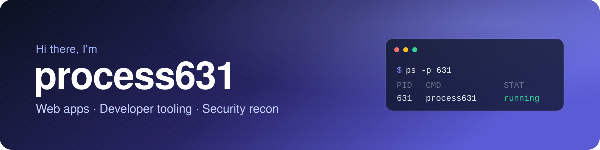

  
  
  

## About

I build practical software for the web: clean, responsive front ends, browser tooling, and small security utilities. I care about apps that are fast, tested, and easy to use, and I like turning quick hacks into tools other people can rely on.

- **Building:** Forkcast, a recipe picker with a step-by-step cook mode (React + TypeScript)
- **Exploring:** web security and reconnaissance, always on authorized targets
- **Interested in:** browser extensions, automation, and developer tooling

## Tech stack

  

## Featured projects

<table>
<tr>
<td width="50%" valign="top">

### 🍴 [Forkcast](https://github.com/process631/forkcast)

Helps you decide what to cook, then walks you through it step by step. A few quick questions about meal, mood, time, and diet rank 790+ real recipes, each with the reasons it matches. Includes ingredient checklists, one-tap timers, and a full-screen cook mode that keeps your screen on.

**[Live site →](https://process631.github.io/forkcast/)** &nbsp;·&nbsp; [Source](https://github.com/process631/forkcast)

</td>
<td width="50%" valign="top">

### 🔍 [Web Recon Tools](https://github.com/process631/web-recon-tools)

Bash scripts for passive and active reconnaissance on authorized web targets. Captures HTTP headers and bodies, snapshots security headers, runs optional httpx fingerprinting, and performs conservative nmap scans of common web ports.

**[Latest release →](https://github.com/process631/web-recon-tools/releases)** &nbsp;·&nbsp; [Source](https://github.com/process631/web-recon-tools)

</td>
</tr>
</table>

 

<i>check your processes ;)</i>

